# Tax Calc
This repository hosts the codebase for a tax calculator application's implementation. This project serves as a qualification task for a coding challenge aimed at candidates applying for the Web Development intern position at Fyle.

# Local Setup
To set up the environment locally, you can either open the `index.js` file directly in a web browser, as it serves as the entry point, or use VSCode extensions such as live server in the root directory.

> Note: Please ensure that you are connected to the internet, as certain CDNs are used for rendering of the page. Failure to do so may result in pages rendering without styles and not functioning as expected.

# Assumptions
* Inputs are simplified to be taken in lakhs for ease of use.
* All fields are assumed to be required and must contain non-negative values. If any value is invalid, the form will not submit and an error message will be displayed.

# Screenshots
## Test Case 1:
Scenario: Valid inputs with No tax
(Total Income less than 8L - Tax should be 0)
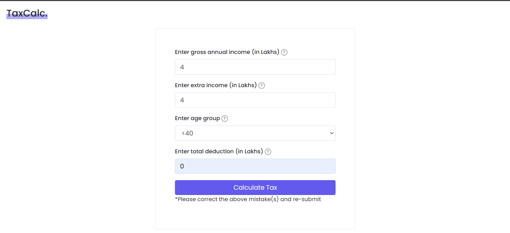
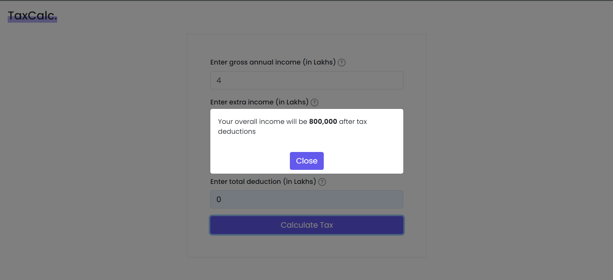

## Test Case 2:
Scenario: Valid inputs with tax and <40 age range
(Gross annual income - 40L, extra income - 0, age-group < 40 and deductions - 0)
Total income: Gross annual + extra income - deduction = 40L + 0 - 0 = 40L
Tax: 0.3 * (40L - 8L) = 9.6L
Total income after tax deduction: 40L - 9.6L = 30.4L
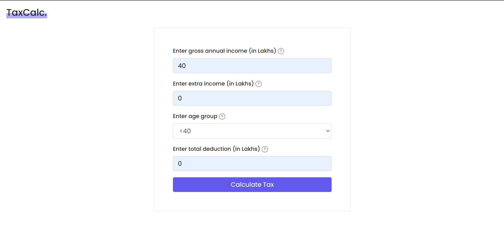
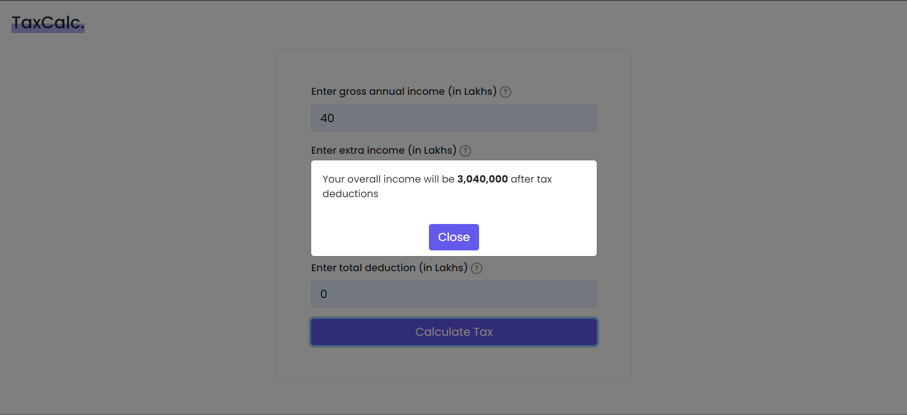

## Test Case 3:
Scenario: Valid inputs with tax and >=40 and <60 age range
(Gross annual income - 40L, extra income - 0, age-group >=40 & <60 and deductions - 0)
Total income: Gross annual + extra income - deduction = 40L + 0 - 0 = 40L
Tax: 0.4 * (40L - 8L) = 12.8L
Total income after tax deduction: 40L - 6.4L = 27.2L
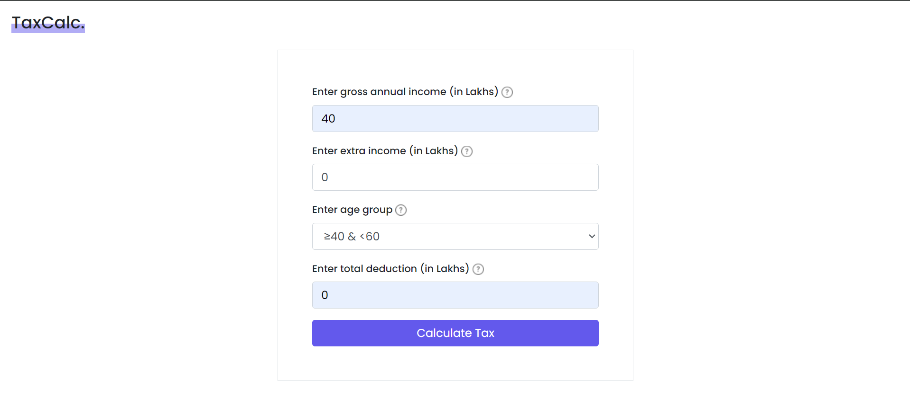
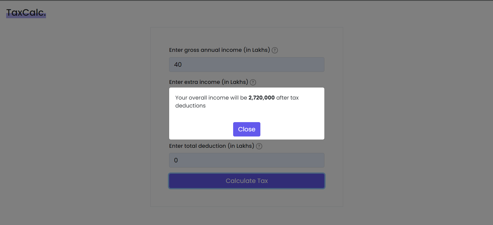

## Test Case 4:
Scenario: Valid inputs with tax and >=60 age range
(Gross annual income - 40L, extra income - 0, age-group <=60 and deductions - 0)
Total income: Gross annual + extra income - deduction = 40L + 0 - 0 = 40L
Tax: 0.1 * (40L - 8L) = 3.2L
Total income after tax deduction: 40L - 3.2L = 36.8L
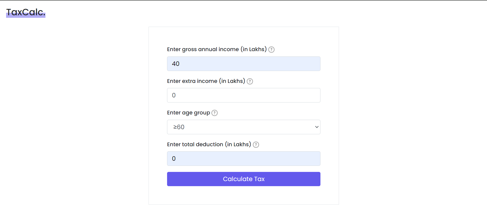
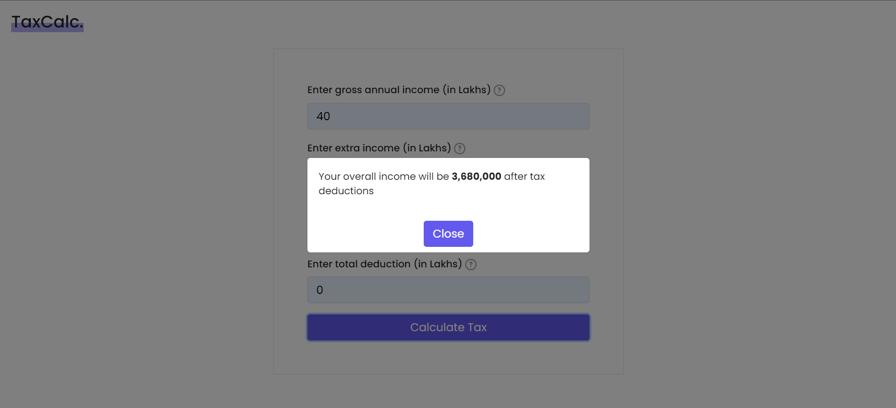

## Test Case 5:
Scenario: Invalid inputs with non-number value
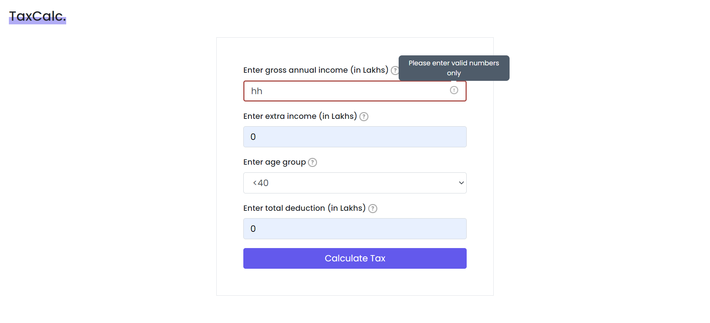

## Test Case 6:
Scenario: Invalid inputs with negative value
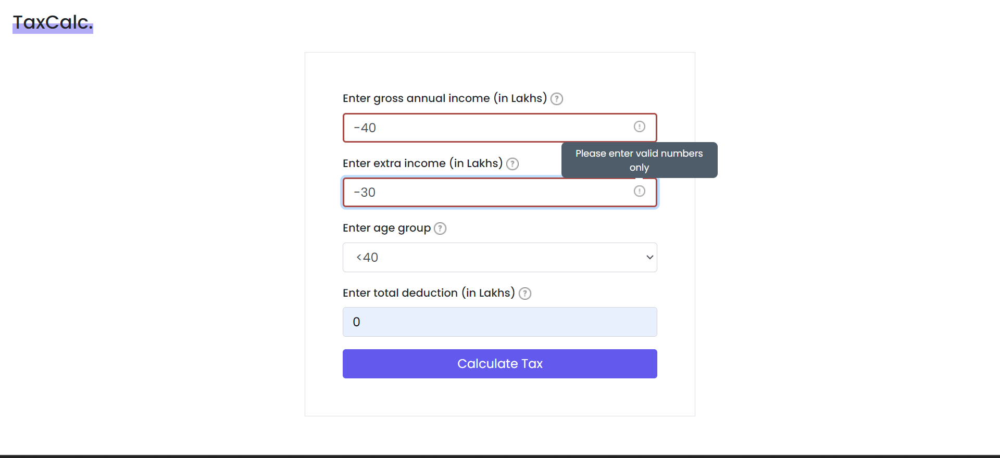

## Test Case 7:
Scenario: Invalid input with no age group selected on submission
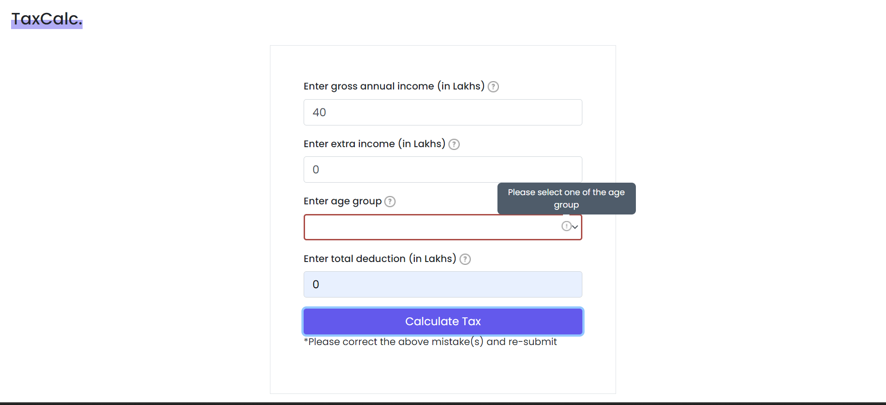
